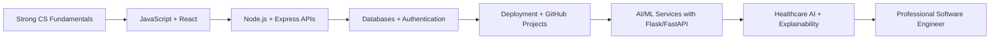

<!-- ===================== PROFILE HEADER ===================== -->

<div align="center">


</div>

<div align="center">

[](https://git.io/typing-svg)

</div>

<div align="center">

<a href="mailto:asimalyas4440@gmail.com">
  
</a>
<a href="https://github.com/asimalyas">
  
</a>
<a href="https://www.linkedin.com/in/muhammad-asim-ilyas-a38b263a2">
  
</a>
<a href="https://asimmportfolio.vercel.app">
  
</a>

</div>

<br/>

---

## 👋 About Me

I am **Muhammad Asim Ilyas**, a **Software Engineering undergraduate at COMSATS University Islamabad, Abbottabad Campus**, currently maintaining a **3.90/4.00 CGPA**.

I build practical software solutions using **Full-Stack Web Development, AI/ML, Computer Vision, and Healthcare AI**. My strongest work is an **explainable ECG-based cardiovascular disease detection system**, where I combine **software engineering, machine learning, ECG signal processing, clinical workflow design, and report generation**.

I am currently focused on becoming a strong **Software Engineer / Full-Stack Developer** with applied **AI/ML** skills.

---

## 🚀 Professional Identity

```txt
Software Engineering Undergraduate
Full-Stack Developer
AI/ML Developer
Healthcare AI Project Builder
Problem Solver
Fast Learner
```

---

## 🎯 Current Focus

* Building production-ready **React + Node.js + MongoDB** applications
* Developing **Flask/FastAPI ML services**
* Improving **AI/ML model deployment and explainability**
* Strengthening **JavaScript, React, REST APIs, SQL, DSA, and system design basics**
* Preparing for **Associate Software Engineer / Junior Full-Stack / AI-ML Trainee roles**

---

## 🏆 Profile Highlights

<div align="center">

| 🎓 Academic Strength | 💻 Development        | 🤖 AI/ML             | 🫀 Flagship Project         |
| -------------------- | --------------------- | -------------------- | --------------------------- |
| **3.90/4.00 CGPA**   | **MERN Stack Intern** | **ML + CV Projects** | **ECG-based CVD Detection** |
| COMSATS University   | React, Node, Express  | scikit-learn, OpenCV | Explainable Healthcare AI   |
| Multiple 4.00 GPAs   | Flask/FastAPI APIs    | TensorFlow/Keras     | Clinical Report Workflow    |

</div>

---

## 🛠️ Tech Stack

### 💻 Programming Languages

<p align="left">
  
</p>

### 🌐 Frontend Development

<p align="left">
  
</p>

### ⚙️ Backend Development & APIs

<p align="left">
  
</p>

### 🧠 AI / ML / Computer Vision

<p align="left">
  
  
  
  
  
  
</p>

```txt
Machine Learning: Regression, Classification, Model Evaluation
Computer Vision: OpenCV, Face Detection, Image Classification
Healthcare AI: ECG Preprocessing, Feature Extraction, Explainability
Data Tools: NumPy, Pandas, Matplotlib, scikit-learn
```

### 🗄️ Databases

<p align="left">
  
</p>

```txt
MS SQL Server | MongoDB | MySQL | PostgreSQL
```

### 🧰 Tools & Platforms

<p align="left">
  
</p>

---

## 🫀 Flagship Project

### Hybrid Multimodal Fusion Framework for Cardiovascular Disease Detection

An AI-based clinical decision-support system for detecting cardiovascular disease using **12-lead ECG data**.

#### 🔍 What it does

* Uploads and processes ECG data
* Performs ECG preprocessing and feature extraction
* Applies ML/DL-based classification
* Generates explainable AI outputs
* Supports doctor review and approval
* Produces clinical-style reports
* Provides role-based workflows for Admin, Doctor, Technician, and Patient

#### 🧠 Core Areas

```txt
ECG Signal Processing
Machine Learning Classification
Multimodal Fusion
Explainable AI
Clinical Report Generation
Role-Based Dashboards
Healthcare Software Workflow
```

#### 🛠️ Technologies

```txt
Python | Flask | FastAPI | scikit-learn | TensorFlow/Keras | OpenCV
React | ECG Signal Processing | Explainability | Report Generation
```

> This project represents my strongest technical direction: **AI-powered healthcare software with real-world clinical workflow thinking**.

---

## 🌟 Featured Projects

<table>
<tr>
<td width="50%">

### 🧠 ECG-Based CVD Detection System

AI-powered healthcare system for cardiovascular disease detection using ECG signal processing, ML classification, explainability, and clinical reporting.

**Tech:** Python, Flask/FastAPI, ML, OpenCV, React

</td>
<td width="50%">

### 🧪 Quiz Test App

Entry-test practice platform with MCQ parsing, timers, result tracking, skipped-question handling, retry flow, local-storage recovery, and AI-assisted question generation.

**Tech:** React, TypeScript, Vite, Local Storage, Vercel

</td>
</tr>

<tr>
<td width="50%">

### 🌐 AI-Integrated Portfolio

Modern developer portfolio with responsive UI, animations, dark/light mode, reusable components, project sections, and AI assistant integration.

**Tech:** React, TypeScript, Tailwind CSS, Framer Motion

</td>
<td width="50%">

### 🏠 Bangalore House Price Prediction

Regression-based ML system for predicting house prices using preprocessing, feature engineering, model training, and Flask-based web interface.

**Tech:** Python, Pandas, scikit-learn, Flask

</td>
</tr>

<tr>
<td width="50%">

### 👤 Celebrity Recognition System

Computer-vision classification system using OpenCV, wavelet transform, SVM classifier, and Flask interface for image-based celebrity recognition.

**Tech:** Python, OpenCV, scikit-learn, Flask

</td>
<td width="50%">

### 🎯 Archery Quest Game

Two-level archery-themed Unity game with enemy targeting, bow-and-arrow mechanics, interactive environments, and gameplay UI.

**Tech:** Unity, C#

</td>
</tr>
</table>

---

## 💼 Professional Experience

### MERN Stack Developer Intern

**Elite Tech Solutions (Pvt.) Limited, Abbottabad**
**Feb 2026 – Mar 2026**

* Developed and improved web application features using **React.js, Node.js, Express.js, and MongoDB**
* Built responsive frontend components and connected them with backend REST APIs
* Worked on routing, forms, database operations, debugging, and feature improvements
* Gained practical experience in teamwork, code organization, and real-world development workflows

---

## 🎓 Education

### Bachelor of Science in Software Engineering

**COMSATS University Islamabad, Abbottabad Campus**
**2022 – Present**
**CGPA: 3.90/4.00**

Key academic strengths:

```txt
Artificial Intelligence
Data Structures and Algorithms
Object-Oriented Programming
Database Systems
Software Engineering
Operating Systems
Formal Methods
Human-Computer Interaction
Software Project Management
Statistics and Probability
Linear Algebra
```

---

## 🏅 Certifications & Achievements

* **Academic Excellence:** Maintained **3.90/4.00 CGPA** in BS Software Engineering
* **Multiple 4.00 Semester GPAs**
* **Certificate of Excellence in Database** — COMSATS University Islamabad, Abbottabad Campus
* **Certificate of Excellence in Game Development** — Runner-up for Archery Quest Game
* **Certificate of Appreciation — Convocation 2023**
* **Certificate of Appreciation — Communication Event**
* **GDGOC Bootcamp Participation**
* **Students Week FA-24 Coordination**
* **Society Appreciation Activities**

---

## 💡 What I Bring

```txt
✔ Strong academic discipline
✔ Fast learning ability
✔ Practical project-building mindset
✔ Full-stack development foundation
✔ AI/ML and computer vision exposure
✔ Healthcare AI project experience
✔ Clean UI thinking
✔ Debugging and problem-solving
✔ Teamwork and documentation
✔ Ability to convert ideas into working applications
```

---

## 📊 GitHub Analytics

<div align="center">


</div>

<div align="center">


</div>

---

## 📈 Contribution Activity

<div align="center">


</div>

---

## 🧭 My Current Learning Roadmap



---

## 🧩 My Development Philosophy

> Build projects that solve real problems.
> Keep learning.
> Keep improving.
> Write cleaner code every day.
> Turn academic knowledge into practical systems.

---

## 🤝 Connect With Me

<div align="center">

<a href="mailto:asimalyas4440@gmail.com">
  
</a>
<a href="https://github.com/asimalyas">
  
</a>
<a href="https://www.linkedin.com/in/muhammad-asim-ilyas-a38b263a2">
  
</a>
<a href="https://asimmportfolio.vercel.app">
  
</a>

</div>

---

<div align="center">

### ⭐ Thanks for visiting my GitHub profile!


</div>
